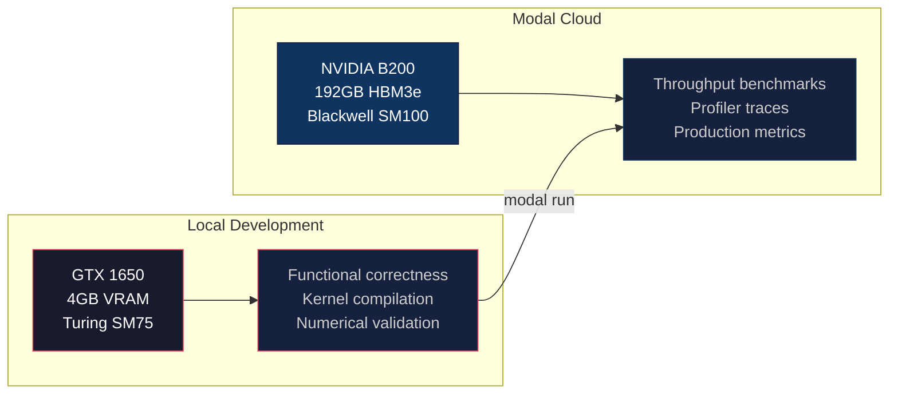
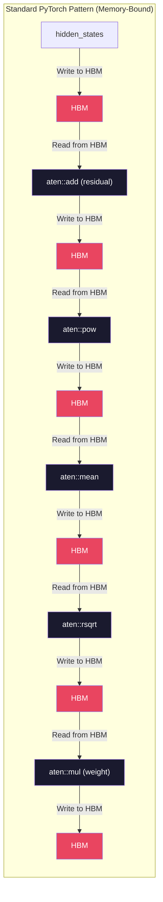
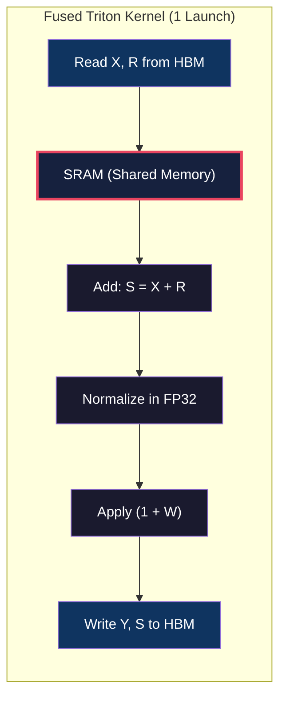
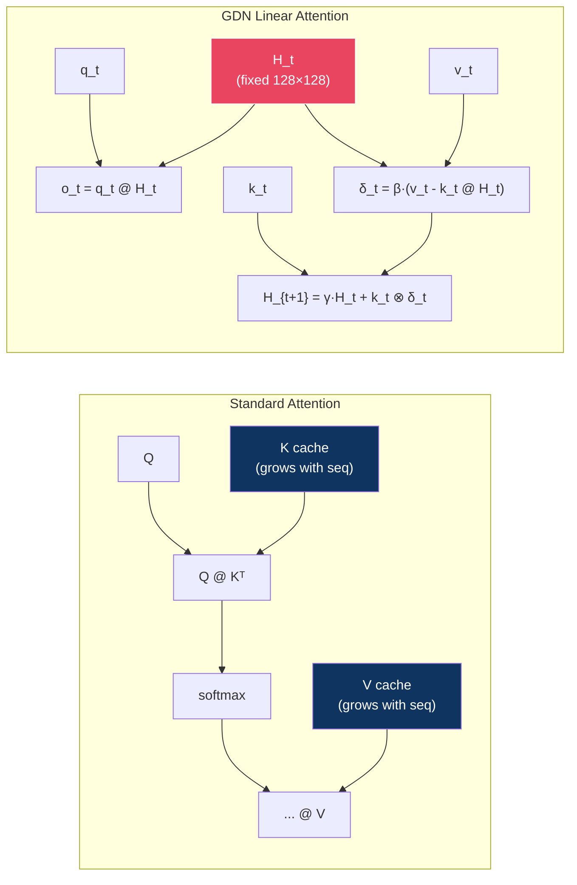
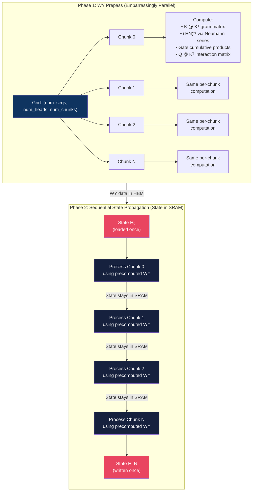
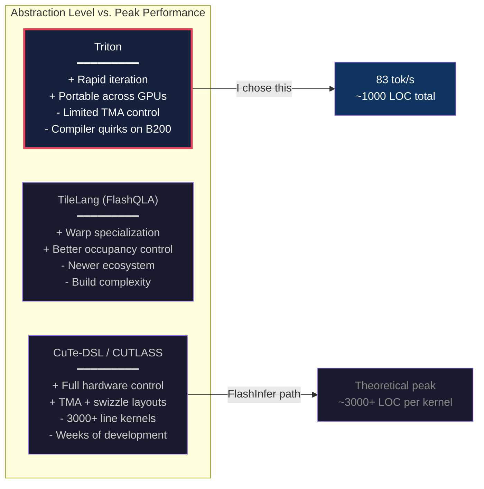
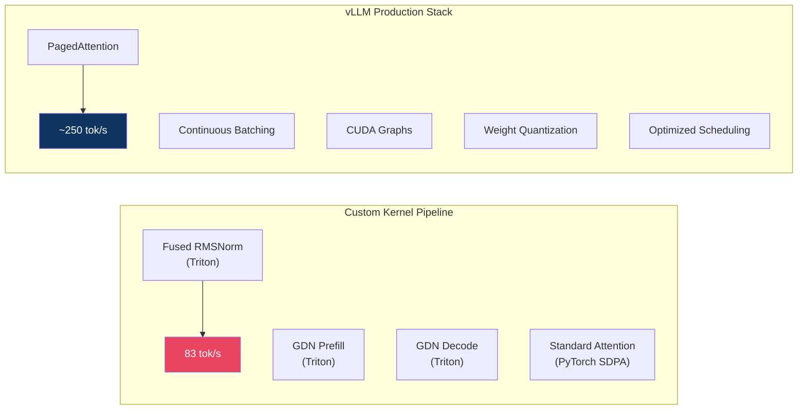
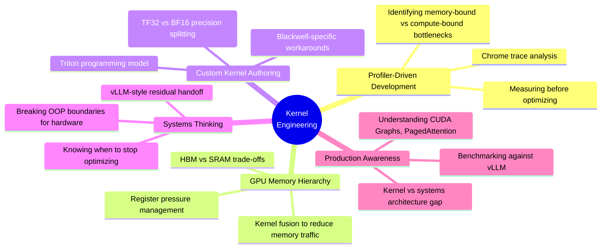

# Bare-Metal Inference: Writing Custom GPU Kernels for Qwen 3.5

> **TL;DR** — I rebuilt the inference stack for the 9-billion-parameter Qwen 3.5 model from scratch in PyTorch, then replaced its critical bottlenecks with hand-written Triton GPU kernels. The result: a **>5× throughput increase** (16 → 83 tok/s on a single NVIDIA B200), achieved by fusing memory-bound operations and eliminating Python-level sequential loops in the novel Gated Delta Network (GDN) linear attention layers.

---

## Table of Contents

- [Project Overview](#project-overview)
- [Hardware & Methodology](#hardware--methodology)
- [Phase 1: Profiler-Driven Diagnosis](#phase-1-profiler-driven-diagnosis)
- [Phase 2: Fusing the Residual Stream](#phase-2-fusing-the-residual-stream)
- [Phase 3: The GDN Linear Attention Kernel](#phase-3-the-gdn-linear-attention-kernel)
- [Engineering Trade-offs](#engineering-trade-offs)
- [Knowing When to Ship](#knowing-when-to-ship)
- [Conclusion](#conclusion)

---

## Project Overview

Qwen 3.5 is not a standard Transformer. It uses a **hybrid architecture** that interleaves traditional multi-head attention layers with **Gated Delta Network (GDN)** linear attention layers — a recurrent state-space mechanism that compresses past context into a fixed-size memory matrix instead of a growing KV cache.

```
Layer 0:  Linear Attention (GDN)
Layer 1:  Linear Attention (GDN)
Layer 2:  Linear Attention (GDN)
Layer 3:  Full Attention (SDPA)    ← every 4th layer
Layer 4:  Linear Attention (GDN)
...
Layer 31: Full Attention (SDPA)
```

This means **75% of the decoder layers** are GDN layers. Any optimization strategy must prioritize these layers — they dominate both prefill and decode latency.

The goal was never to build a production serving system. It was to understand, from first principles, what happens between the CUDA cores and HBM when you actually generate text — and to prove that **targeted kernel-level surgery** can unlock massive speedups that no amount of `torch.compile` or framework configuration can match.

### What I Built

| Component | Description |
|---|---|
| [qwen.py](file:///mnt/Code/qwen_3.5/qwen.py) | Custom 983-line PyTorch model — every layer, every projection, every cache, written by hand |
| [fused_zero_centered_rmsnorm.py](file:///mnt/Code/qwen_3.5/kernels/triton/fused_zero_centered_rmsnorm.py) | Triton kernel fusing residual addition + zero-centered RMSNorm in SRAM |
| [prefill.py](file:///mnt/Code/qwen_3.5/kernels/linear_attention/prefill.py) | 993-line Triton chunkwise GDN prefill kernel with WY decomposition |
| [decode.py](file:///mnt/Code/qwen_3.5/kernels/linear_attention/decode.py) | Triton single-token GDN decode kernel |
| [modal/inference.py](file:///mnt/Code/qwen_3.5/modal/inference.py) | Modal deployment to NVIDIA B200 with weight loading & generation loop |
| [modal/vllm_bench.py](file:///mnt/Code/qwen_3.5/modal/vllm_bench.py) | Apples-to-apples vLLM benchmark on identical hardware |

---

## Hardware & Methodology

### The Two-GPU Strategy



| | GTX 1650 (Local) | NVIDIA B200 (Modal) |
|---|---|---|
| **Role** | Develop & validate | Benchmark & profile |
| **VRAM** | 4 GB GDDR6 | 192 GB HBM3e |
| **Memory BW** | 128 GB/s | 8,000 GB/s |
| **Tensor Cores** | None (Turing) | 5th-gen (Blackwell) |
| **Why** | Free, instant iteration | Real throughput numbers |

### Profiling Setup

All profiler traces were captured on the B200 using PyTorch's built-in `torch.profiler` with CPU + CUDA activity recording, memory tracking, and stack traces enabled. The profiling script ([inference-torch-profiler.py](file:///mnt/Code/qwen_3.5/modal/inference-torch-profiler.py)) instruments both the prefill pass and a configurable number of decode steps, then exports Chrome traces for analysis.

Three traces were captured at key milestones to diagnose bottlenecks. 

> [!WARNING]
> **A Note on Profiling Overhead:** The times recorded in the traces are significantly slower than actual inference speed. PyTorch's profiler (with memory tracking, stack tracing, and `CUDA_LAUNCH_BLOCKING=1` enabled) introduces massive overhead, inflating a ~1.8s generation to over 6.5s. The throughput numbers reported in the performance milestones below reflect **actual, unprofiled inference performance** (16 → 50 → 83 tok/s), while the trace times listed here merely show the relative reduction in kernel execution time under tracing conditions.

| Trace | Stage | Profiled Time (Overhead Included) | Actual Inference Throughput |
|---|---|---|---|
| `initial_trace.json` | Pure PyTorch baseline | 10.53 s | ~16.16 tok/s |
| `fused_rms_norm.json` | + Fused Triton RMSNorm | 10.40 s | ~49.64 tok/s |
| `triton_linear_attention.json` | + Triton GDN kernels | 6.51 s | ~82.87 tok/s |

---

## Phase 1: Profiler-Driven Diagnosis

### The Initial Trace

Before writing a single kernel, I needed to understand *where the time was actually going*. I deployed the pure-PyTorch model to the B200 and captured a full profiler trace.


The trace revealed a devastating pattern. A single decode step — which should be a clean pipeline of matrix multiplications — was instead a chaotic cascade of **dozens of tiny CUDA kernels**:

```
aten::add          →  50 µs  (residual addition)
aten::pow          →  30 µs  (variance computation)
aten::mean         →  40 µs  (reduction for RMSNorm)
aten::rsqrt        →  20 µs  (inverse sqrt)
aten::mul          →  25 µs  (weight application)
aten::to           →  15 µs  (dtype cast)
```

Each of these operations individually touches HBM — reading the full hidden state (4096 × bf16 = 8 KB per token per operation), performing one arithmetic step, and writing the result back. But the real cost wasn't the arithmetic. It was the **kernel launch overhead**: each `aten::` op requires the CPU to enqueue a kernel, synchronize dispatch, and wait for the GPU to actually start it.

### The Architectural Flaw

The standard PyTorch / HuggingFace pattern treats each layer as an isolated object:



**Six HBM round-trips for a single normalization.** On the B200 with 8 TB/s bandwidth, each round-trip for a 4096-dim hidden state costs ~1 µs. But with kernel launch overhead, each step balloons to 20-50 µs. Across 32 layers × 2 norms per layer = **64 normalization passes per decode step**.

This is the fundamental insight: **PyTorch's OOP abstraction (each `nn.Module` is a self-contained forward pass) directly conflicts with the GPU memory hierarchy.**

---

## Phase 2: Fusing the Residual Stream

### The vLLM-Style Residual Handoff

The solution comes from how production inference systems like vLLM handle residual connections. Instead of treating each decoder layer as:

```python
# Standard: Layer owns its residual
hidden = layer_norm(hidden + residual)
```

We restructure the decoder to **return the residual as a separate tensor**, allowing the *next* layer's normalization kernel to catch both values and fuse the addition:

```python
# vLLM-style: Residual flows between layers
hidden, residual = fused_norm(hidden, residual)
```

### The Fused Triton Kernel

Here is the complete kernel — 48 lines that replaced ~6 PyTorch operators:

```python
@triton.jit
def _fused_zero_centered_rmsnorm(
    Y_ptr, Y_row_stride,
    S_ptr, S_row_stride,     # output residual
    X_ptr, X_row_stride,
    R_ptr, R_row_stride,     # input residual
    W_ptr, n_cols, eps,
    BLOCK_SIZE: tl.constexpr,
):
    row_idx = tl.program_id(0)
    col_offsets = tl.arange(0, BLOCK_SIZE)
    mask = col_offsets < n_cols

    # Step 1: Load X and R from HBM (the ONLY HBM read)
    X_row = tl.load(X_ptr + row_idx * X_row_stride + col_offsets, mask=mask)
    R_row = tl.load(R_ptr + row_idx * R_row_stride + col_offsets, mask=mask)

    # Step 2: Fused residual add (stays in SRAM)
    S_row = X_row + R_row
    tl.store(S_ptr + row_idx * S_row_stride + col_offsets, S_row, mask=mask)

    # Step 3: RMSNorm in FP32 (stays in SRAM)
    S_row = S_row.to(tl.float32)
    W_row = tl.load(W_ptr + col_offsets, mask=mask).to(tl.float32)

    mean_square = tl.sum(S_row * S_row, axis=0) / n_cols
    rstd = tl.rsqrt(mean_square + eps)
    S_row = S_row * rstd

    # Step 4: Zero-centered weight trick (Qwen-specific)
    Y_row = S_row * (1.0 + W_row)

    # Step 5: Write normalized output to HBM (the ONLY HBM write)
    tl.store(Y_ptr + row_idx * Y_row_stride + col_offsets, Y_row.to(S_row_dtype), mask=mask)
```

### What Makes This Kernel Non-Trivial

**1. The Zero-Centered Weight Trick**

Standard RMSNorm applies `output = norm(x) * weight`. Qwen 3.5 uses **zero-centered** weights initialized at 0, applying `output = norm(x) * (1.0 + weight)`. This is a subtle but important detail — using standard RMSNorm would produce incorrect activations and eventual collapse.

**2. Strict FP32 Upcasting**

The kernel must upcast the accumulated sum to FP32 before computing the variance. BF16 has only ~3 decimal digits of precision; accumulating 4096 squared values in BF16 produces catastrophic rounding errors that cascade through 32 decoder layers.

**3. Residual as Dual Output**

The kernel produces two outputs: the normalized hidden state `Y` and the accumulated residual `S`. The residual is written back to HBM so the next layer can read it — but the key insight is that the **normalization and addition happen in a single kernel launch**, eliminating 5 intermediate HBM round-trips.

### The Memory Hierarchy Win



| Metric | Before (PyTorch) | After (Fused Triton) |
|---|---|---|
| HBM round-trips per norm | 6 | 1 |
| Kernel launches per norm | 6 | 1 |
| Total norms per decode step | 64 | 64 |
| Kernel launches eliminated | — | **320 per step** |

### Restructuring the Decoder Layer

The kernel alone isn't enough — the decoder layer's `forward()` method had to be restructured to support the residual handoff:

```python
class Qwen3_5DecoderLayer(nn.Module):
    def forward(self, hidden_states, residual, ...):
        if residual is None:
            # First layer: no residual yet, use standard norm
            residual = hidden_states
            hidden_states = self.input_layernorm_standard(hidden_states)
        else:
            # Subsequent layers: fused residual + norm
            hidden_states, residual = self.input_layernorm_fused(X=hidden_states, R=residual)

        # Token mixer (attention or GDN)
        hidden_states = self.token_mixer(hidden_states)

        # Post-attention: always fused
        hidden_states, residual = self.post_attention_layernorm(X=hidden_states, R=residual)
        hidden_states = self.mlp(hidden_states)

        return hidden_states, residual  # ← residual flows to next layer
```

This required modifying the weight loading logic to duplicate `input_layernorm.weight` into both a `standard` and `fused` slot — a small but necessary engineering detail.

### Performance Milestone 1


| Implementation | Throughput (B200, 150 tokens) |
|---|---|
| Pure PyTorch baseline | ~16 tok/s |
| + Fused Triton RMSNorm | **~50 tok/s** |
| **Speedup** | **3.07×** |

The fused RMSNorm alone delivered a **3× throughput improvement**. But the profiler now revealed the next bottleneck — the GDN linear attention layers, which were still running through pure PyTorch with sequential `for` loops.

---

## Phase 3: The GDN Linear Attention Kernel

### Why GDN Is Different From Standard Attention

Standard multi-head attention (used in every 4th layer) processes all tokens in parallel via `Q @ K.T @ V`. The KV cache grows linearly with sequence length, but the attention computation itself is embarrassingly parallel.

GDN linear attention works fundamentally differently. It maintains a **fixed-size recurrent state matrix** $H \in \mathbb{R}^{K \times V}$ (128 × 128 = 16 KB per head) that compresses all past context:



The recurrence relation for each token:

$$H_{t+1} = \gamma_t \cdot H_t + k_t \otimes \beta_t \cdot (v_t - k_t^\top H_t)$$
$$o_t = q_t^\top \cdot H_{t+1}$$

Where $\gamma_t = \exp(-\exp(A_{\log}) \cdot \text{softplus}(a_t + \text{dt\_bias}))$ is a learned gating decay.

### The PyTorch Trap

The pure-PyTorch implementation of the GDN prefill used a sequential `for` loop over chunks:

```python
# The bottleneck: sequential iteration
for i in range(total_sequence_length // chunk_size):
    q_i, k_i, v_i = query[:, :, i], key[:, :, i], value[:, :, i]
    attn = q_i @ k_i.transpose(-1, -2) * decay_mask[:, :, i]
    v_prime = k_cumdecay[:, :, i] @ last_recurrent_state  # ← HBM read
    v_new = v_i - v_prime
    attn_inter = (q_i * g[:, :, i, :, None].exp()) @ last_recurrent_state  # ← HBM read
    core_attn_out[:, :, i] = attn_inter + attn @ v_new
    last_recurrent_state = (  # ← HBM write, then read again next iteration
        last_recurrent_state * g[:, :, i, -1, None, None].exp()
        + (k_i * ...).transpose(-1, -2) @ v_new
    )
```

**Every iteration** of this loop performs a round-trip to High Bandwidth Memory (HBM):
1. **Reads** the recurrent state matrix $H$ from HBM:
   $$\text{State Size} = 128 \times 128 \text{ elements} \times 4 \text{ bytes (fp32)} = 64\text{ KB per head}$$
   $$64\text{ KB} \times 32\text{ heads} = 2\text{ MB per layer}$$
2. Performs a few small matrix multiplications (matmuls).
3. **Writes** the updated 2 MB state matrix back to HBM.
4. Returns execution control to Python for the next iteration.

For a prefill sequence of 512 tokens with a chunk size of 64, we process $\frac{512}{64} = 8$ chunks sequentially. The total redundant HBM traffic is:
$$\text{Total HBM Traffic} = 8 \text{ chunks} \times (2\text{ MB read} + 2\text{ MB write}) = 32\text{ MB}$$

This is **32 MB of redundant HBM traffic** per layer—for data that could have stayed entirely in the GPU's SRAM (shared memory, which is ~228 KB on local development hardware) the entire time.

### The Triton Solution: Chunkwise GDN with Persistent State

The key insight from the [Flash Linear Attention (FLA)](https://github.com/fla-org/flash-linear-attention) paper: the chunkwise recurrence can be reformulated so that **intra-chunk interactions are parallel** (matmuls) while **inter-chunk state updates are sequential but tiny** (the state matrix stays in SRAM).

#### Architecture of the Prefill Kernel

The prefill is split into two phases for maximum parallelism:



#### The WY Decomposition

The core mathematical trick: within each chunk, the delta rule creates a lower-triangular system:

$$(I + N) \cdot X = \beta \cdot \left(\frac{V}{G} - K \cdot S_{\text{in}}^\top\right)$$

Where $N$ is a strictly-lower-triangular nilpotent matrix ($N[j,i] = \beta_j \cdot (k_j \cdot k_i)$ for $i < j$). Since $N$ is nilpotent of order $C$ (chunk size), we can invert $(I+N)$ exactly via the **Neumann series**:

$$(I + N)^{-1} = (I - N)(I + N^2)(I + N^4) \cdots$$

This is implemented as a fixed-depth doubling chain:

```python
@triton.jit
def _apply_unit_lower_inverse(nil, rhs, BV: tl.constexpr, CHUNK: tl.constexpr):
    """(I+N)^{-1} via doubling. Uses TF32 tensor cores for numerical stability."""
    sol = rhs - _dot_f32(nil, rhs)        # (I - N) @ rhs
    power = _dot_f32(nil, nil)             # N²
    if CHUNK >= 4:
        sol = sol + _dot_f32(power, sol)   # += N² @ sol
        power = _dot_f32(power, power)     # N⁴
    if CHUNK >= 8:
        sol = sol + _dot_f32(power, sol)   # += N⁴ @ sol
        power = _dot_f32(power, power)     # N⁸
    if CHUNK >= 16:
        sol = sol + _dot_f32(power, sol)   # += N⁸ @ sol
        power = _dot_f32(power, power)     # N¹⁶
    if CHUNK >= 32:
        sol = sol + _dot_f32(power, sol)   # += N¹⁶ @ sol
    return sol
```

#### Blackwell-Specific Engineering

Several details were critical for B200 performance:

**1. TF32 vs BF16 Precision Split**

The nilpotent inverse chain uses **TF32** (19-bit mantissa) because errors compound across the log-depth chain. But the large K=128 contractions (`K @ K^T`, `Q @ state^T`) use **BF16** tensor cores, which are ~4× faster and the rounding is bounded for single-shot matmuls.

**2. The Blackwell Code-Gen Workaround**

A Triton compiler bug on B200 (the `TritonGPUHoistTMEMAlloc` pass) would incorrectly fuse `tl.dot` outputs with downstream additions. The workaround: wrapping every dot product in an inline PTX `mov.f32` instruction to create an artificial compiler barrier:

```python
@triton.jit
def _dot_f32(a, b):
    out = tl.dot(a, b, input_precision="tf32", out_dtype=tl.float32)
    return tl.inline_asm_elementwise(
        asm="mov.f32 $0, $1;",
        constraints="=r,r",
        args=[out], dtype=tl.float32, is_pure=True, pack=1,
    )
```

**3. Adaptive Tiling**

The kernel adapts its tile sizes based on workload characteristics:

| Parameter | Small Batch | Large Batch | Rationale |
|---|---|---|---|
| `CHUNK` | 32 | 16 | Longer chunks amortize overhead; shorter chunks reduce gram matrix size |
| `BV` (V-tile) | 16 | 16-32 | Balances SM occupancy vs. register pressure |
| `num_warps` | 4 | 2 | Fewer warps = less synchronization for parallel-heavy workloads |

#### The Decode Kernel

The decode kernel is simpler — for a single token, there's no chunking. The kernel maps `grid = (batch_size, num_v_heads * n_v_tiles)` and each thread block:

1. Loads the state tile $H[\text{BV}, K]$ from HBM (one read)
2. Computes gate decay $\gamma = \exp(-\exp(A_{\log}) \cdot \text{softplus}(a + \text{dt\_bias}))$
3. Applies the recurrent update entirely in registers
4. Writes output and new state (one write)

```python
@triton.jit
def gdn_decode_kernel(...):
    # Gate computation
    g = tl.exp(-tl.exp(A_log_val) * softplus_x)
    beta = tl.sigmoid(b_val)

    # Decay existing state
    old_state = g * b_h

    # Delta rule update
    old_v = tl.sum(old_state * b_k[None, :], axis=1)
    delta_v = beta * (b_v - old_v)

    # Output BEFORE state update (frees registers)
    old_o = tl.sum(old_state * b_q[None, :], axis=1)
    kq = tl.sum(b_k * b_q)
    b_o = scale * (old_o + delta_v * kq)
    tl.store(out_ptr + ..., b_o.to(tl.bfloat16))

    # State update (register-only, no extra HBM read)
    state_out = old_state + delta_v[:, None] * b_k[None, :]
    tl.store(new_state_ptr + ..., state_out)
```

> [!TIP]
> Notice the **deliberate ordering**: output is stored *before* computing `state_out`. This frees the `old_o` registers so the `state_out` computation doesn't spill to local memory. On Blackwell with 255 registers per thread, this kind of manual register scheduling matters.

### Performance Milestone 2


| Implementation | End-to-End Time (150 tok) | Throughput |
|---|---|---|
| Pure PyTorch baseline | 9.28 s | ~16 tok/s |
| + Fused Triton RMSNorm | 3.02 s | ~50 tok/s |
| + Triton GDN Kernels | 1.81 s | **~83 tok/s** |

---

## Engineering Trade-offs

### The Abstraction Spectrum

This project required evaluating three kernel authoring frameworks:



### The Triton Friction Points

Working on the B200 revealed real Triton limitations:

1. **No explicit TMA control**: The B200's Tensor Memory Accelerator (TMA) can asynchronously prefetch tiles from HBM to shared memory. Triton's compiler *sometimes* uses TMA under the hood, but you can't control the prefetch schedule or tile ordering.

2. **Swizzle layout opacity**: NVIDIA's shared-memory swizzle patterns prevent bank conflicts for tensor-core loads. Triton handles this automatically but sometimes chooses suboptimal layouts for non-standard tile shapes.

3. **Compiler bugs**: The `TritonGPUHoistTMEMAlloc` codegen bug forced inline-assembly workarounds (the `mov.f32` barriers described above). This is documented in FLA / Tomás Ruiz's B200 work.

### Why I Stuck With Triton

Despite these friction points, Triton was the right choice:

| Factor | Triton | CuTe/CUTLASS |
|---|---|---|
| Iteration speed | ~minutes per kernel change | ~hours (rebuild + test) |
| Lines of code | ~1100 total | ~3000+ per kernel |
| Maintainability | High (Python-like) | Low (template metaprogramming) |
| Performance achieved | 83 tok/s (**sufficient**) | Theoretical ceiling only |
| Time to results | ~2 weeks | ~2+ months |

**The engineering judgment**: hitting 83 tok/s with Triton in weeks beats hitting 90 tok/s with CuTe in months. The marginal 8% improvement doesn't justify 5× the development time for a research/portfolio project.

---

## Knowing When to Ship

### The vLLM Reality Check

To understand where my kernel optimizations sit relative to a production system, I benchmarked against vLLM on identical hardware:



| System | Throughput | Notes |
|---|---|---|
| Custom kernels (this project) | **83 tok/s** | Single-request, no batching, pure kernel optimization |
| vLLM v0.20.1 | **~250 tok/s** | Full production stack with PagedAttention, CUDA Graphs, etc. |

### Analyzing the Gap

The remaining 3× gap is **not** a kernel performance issue. It's a **systems architecture** difference:

| Feature | My Implementation | vLLM |
|---|---|---|
| **CUDA Graphs** | No — each decode step incurs CPU dispatch | Yes — entire decode captured as a single graph replay |
| **Continuous Batching** | No — single request only | Yes — amortizes overhead across concurrent requests |
| **PagedAttention** | No — static pre-allocated caches | Yes — dynamic memory management |
| **torch.compile** | No | Partial graph compilation |
| **Weight format** | Raw safetensors (bf16) | Optimized formats (potentially quantized) |
| **Python overhead** | Full Python decode loop | Minimal (graph capture eliminates) |

The insight: **kernel optimization and systems optimization are complementary layers.** My fused kernels could be dropped into a vLLM-style framework to provide benefits on top of CUDA Graphs and continuous batching.

### The Decision to Ship

> [!IMPORTANT]
> The diminishing returns curve is real. Going from 16 → 83 tok/s required ~1100 lines of Triton. Getting from 83 → 100 tok/s would require either CUDA Graphs (a systems change, not a kernel change) or rewriting the kernels in CuTe (weeks of work for single-digit percentage gains).

I declared victory on the kernel optimization phase because:

1. **The educational objective was met**: I demonstrated profiler-driven diagnosis → custom kernel → measurable speedup across two distinct bottleneck types (memory-bound and compute-bound).

2. **The remaining gap is architectural**: Closing it requires systems-level work (CUDA Graphs, batching, scheduling) — a different skill set that I can pursue independently.

3. **Negative ROI**: Further micro-optimizing the kernels (e.g., implementing TMA prefetch in PTX) would consume weeks for a few percentage points, with diminishing portfolio value.

---

## Conclusion

### What This Project Demonstrates



### The Core Philosophy

High-performance inference is not about writing faster matrix multiplications. It's about **respecting the memory hierarchy**:

1. **Data that doesn't leave SRAM doesn't cost you HBM bandwidth.**
2. **Kernels that don't launch don't cost you dispatch overhead.**
3. **Python loops that don't exist don't cost you interpreter time.**

Every optimization in this project followed the same pattern: identify where data is being unnecessarily shuffled between memory levels, then write a kernel that keeps it where it needs to be.

### By The Numbers

| Metric | Value |
|---|---|
| Model | Qwen 3.5-9B (hybrid GDN + attention) |
| Hardware | NVIDIA B200 (192 GB HBM3e, SM100) |
| Baseline throughput | 16 tok/s |
| Final throughput | **83 tok/s** |
| Total speedup | **5.19×** |
| Custom Triton LOC | ~1,100 lines |
| PyTorch model LOC | ~983 lines |
| Profiler traces captured | 3 (initial, fused norm, fused GDN) |

---

*Built by Darshan Baslani. Kernels prototyped on a GTX 1650, benchmarked on NVIDIA B200 via Modal.*

*Source: [github.com/Darshan-Baslani/qwen3.5-optimized](https://github.com/Darshan-Baslani/qwen3.5-optimized)*
